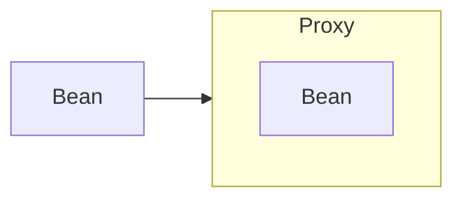

# AOP

This test case shows how works AOP in Spring.

## Terminology

There are important terms in AOP.

- Aspect: A modularization of a concern that cuts across multiple classes.
- Advice: The action to be taken at a particular join point.
- Join point: A point during the execution of a program, such as the execution of a method or the handling of an
  exception.
- Pointcut: A predicate that matches join points.
- Weaving: Linking aspects with other application types or objects to create an advised object.

### In Spring

This terminology is mapped to the following Spring concepts:

- Aspect: Defined class using the `@Aspect` annotation. It can be registered as a bean in the Spring container.
- Advice: Defined method using the annotations like `@Before`, `@After`, `@AfterReturning`, `@AfterThrowing`,
  `@Around`.
- Join point: Represents a method execution.
- Pointcut: Defined by the pointcut expression using the `@Pointcut` annotation or directly in the advice annotation
  value.
- Weaving: Spring AOP performs weaving at runtime.

### Pointcut expression

A pointcut expression is a predicate that matches join points. See the following expression

```text
modifiers-pattern? return-type-pattern package.class.method(param-pattern)
``` 

package . means all sub-packages. For example, `com..` means `com` and all sub-packages.

```java

@Pointcut("execution(public * com.whatasame.aop..*.*(..))")
private void anyPublicMethod() {
}
```

The above expression matches all public methods regardless of their return type in any class within the `
com.whatasame.aop` package and its sub-packages, any number of parameters.

## Spring AOP proxy

Spring AOP uses proxy to implement the aspect. The proxy wraps the target object and intercepts calls to the target
object to invoke the advice.



Spring AOP uses either JDK dynamic proxies or CGLIB to create the proxy for a given target object.

- JDK dynamic proxy: Built in to the JDK. It only supports proxying interfaces by implementing the interfaces of the
  target object.
- CGLIB proxy: A third-party library. It supports proxying classes by extending the target object's class.

If the target object to be proxied implements at least one interface, a JDK dynamic proxy is used. If the target object
does not implement any interfaces, a CGLIB proxy is created.

### Force to use CGLIB proxy in Spring Boot

Cause JDK dynamic proxy only supports proxying interfaces, there is option to force to use CGLIB proxy in Spring
called `proxyTargetClass`. It is set to `false` by default in Spring whereas it is set to `true` in Spring Boot.

```java
@SpringBootApplication
// @EnableAspectJAutoProxy(proxyTargetClass = true) // default is true in Spring Boot
public class AopApplication {

    public static void main(String[] args) {
        SpringApplication.run(AopApplication.class, args);
    }
}
```

## References

- [Spring AOP | Spring document](https://docs.spring.io/spring-framework/docs/current/reference/html/core.html#aop)
- [Proxying Mechanisms | Spring Framework|](https://docs.spring.io/spring-framework/docs/current/reference/html/core.html#aop-proxying)
